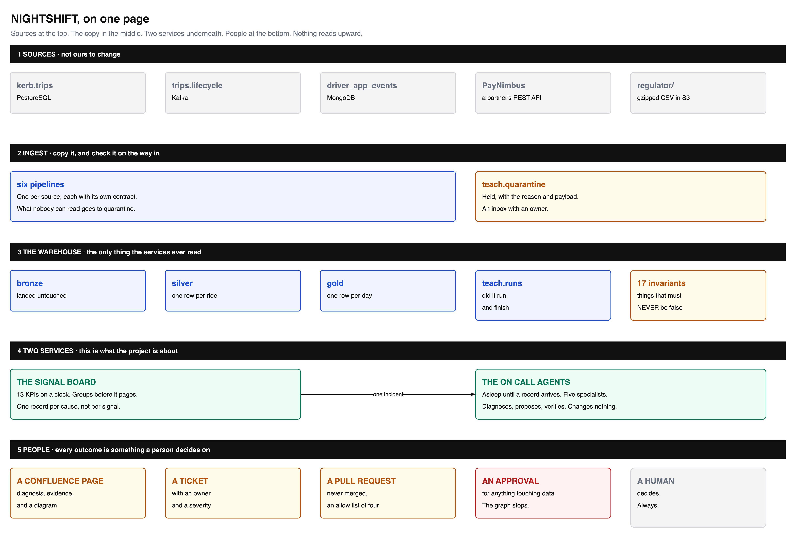
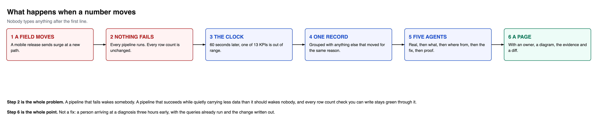
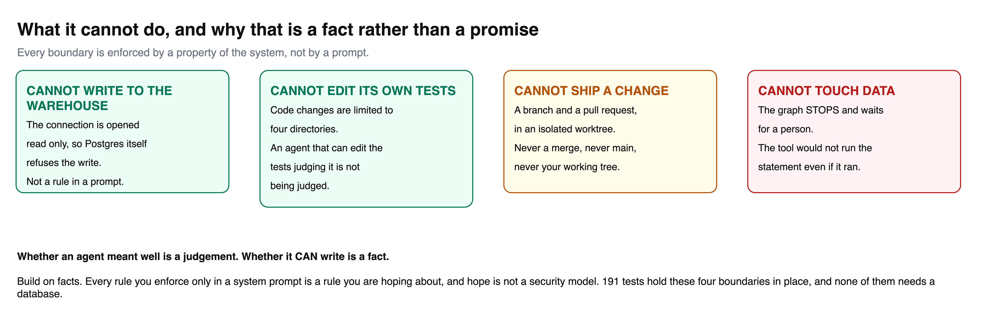

<div align="center">

# NIGHTSHIFT · ON CALL

### A data warehouse, and the two services that watch it while you sleep

<br>

[](https://www.python.org)
[](https://docs.langchain.com)
[](https://fastapi.tiangolo.com)
[](https://www.postgresql.org)
[](https://redpanda.com)
[](https://www.mongodb.com)
[](https://min.io)
[](https://airflow.apache.org)
[](https://www.docker.com)
[](tests/)
[](LICENSE)

<br>

**A 90 minute class · Nineteen notebooks · Eight pipelines · Six sources · Thirteen KPIs · Five agents · One command**

<br>

[Quick start](#quick-start) · [What happens at 3am](#what-happens-at-3am) · [The two services](#the-two-services) · [What it refuses to do](#what-it-refuses-to-do) · [Notebooks](#the-nineteen-notebooks) · [Docs](docs/)

</div>

<br>



<br>

---

## The problem this exists for

A field moves upstream. Every pipeline still runs. Every pipeline still reports
success. Not one row count changes.

And a number that finance publishes quietly stops being true.

**No error. No failed run. No log line.** Every check you can write stays green,
and somebody finds out six weeks later from a board pack.

This project builds the warehouse where that can happen, then builds the two
services that catch it: a **signal board** that measures thirteen KPIs on a
clock, and a **multi agent system** that wakes up when one of them moves, works
out why, and writes the incident page with an owner on it.

Everything runs on your laptop. Nothing is mocked. There is a reset button that
always works.

<br>

---

## What happens at 3am



Nobody types anything after step one. Here is a real run, unedited:

```
14:49:15  cycle 1: 13 evaluated, 4 breached, 0.09s
   pipelines_failing   dispatched   INC1ED4D348BE (4 signals)
      pipelines_failing moved in the same cycle, so every other signal
      here is downstream of work that did not happen
```

```
triage -> investigate_data -> investigate_lineage -> remediate -> verify

what breached:  surge_coverage_pct in teach.bronze_driver_app, 97.3% vs 100%
what is wrong:  395 rows missing surge, all from app_version 4.2.0
where it came:  pipelines/p3_bronze_driver_app.py. 4.2.0 moved the value to
                payload.pricing.surgeFactor, which the contract does not read
what was made:  a Confluence page, ticket NS-9821E2, and a diff
what a human:   approve the contract change, re-run p3, re-check the KPI
```

**Nothing about that incident is written into any prompt.** There is no list of
known problems anywhere in this repository. The agents were given a method and a
toolbox, which is why a problem nobody has seen before is worked the same way.

<br>

---

## Quick start

You need **Docker Desktop** and **Python 3.11+**. Give Docker **6 GB** of memory:
the estate runs a dozen containers and this is the single most common reason a
first run fails.

```bash
git clone https://github.com/fnusatvik07/nightshift-oncall.git
cd nightshift-oncall

python3 -m venv .venv && source .venv/bin/activate
pip install -r requirements.txt -r requirements-oncall.txt

cp .env.example .env          # add OPENAI_API_KEY for the agents
```

```bash
docker compose -f platform/docker-compose.yml up -d
python -m seed                # a month of trading, about 40 seconds
python cli.py run all         # eight pipelines, about 35 seconds
```

Then start the two services and watch them work:

```bash
docker compose -f platform/docker-compose.yml up -d signal-api signal-scheduler agent

python break_it.py && python cli.py run all      # move a field upstream
docker logs -f nightshift-signal-scheduler       # and touch nothing
```

<details>
<summary><b>Using Claude Code?</b> There is a file for that.</summary>

<br>

[`CLAUDE.md`](CLAUDE.md) is written to be executed rather than read. Open the
repo and say **"set this project up locally for me"**. It checks prerequisites,
waits for health properly, seeds, verifies, and knows the usual failure modes.

</details>

<br>

---

## The two services

### One · the signal board

Thirteen KPIs, on a clock, in three containers, because answering questions and
asking them are different jobs.

> **A KPI is a number with a definition and an owner. It can never fire.**
> **A signal is a KPI plus a baseline plus a tolerance. That one can breach.**

```bash
python cli.py kpis          # the catalogue, and who owns each number
python cli.py signals       # evaluate every one, right now
python cli.py invariants    # the things that must always be true
python cli.py incidents     # one row per cause, not per signal
```

| Endpoint | Does | Side effects |
|:--|:--|:--|
| `GET /signals` | evaluates everything | **none** |
| `GET /kpis/{name}` | the definition, **including the query** | none |
| `GET /invariants` | the 17 things that must never be false | none |
| `POST /evaluate` | the only one that can raise an incident | **wakes people** |

A dashboard refreshing every ten seconds must not be able to page somebody,
which is why measuring is a `GET` and raising is a `POST`.

#### It groups before it pages

Thirteen signals watch one warehouse, so a dead pipeline breaches six at once.
Six records would mean six investigations for one cause.

```
incident         lead signal          sev       signals  status     owners
INCA8AD829398    pipelines_failing    critical        4  diagnosed  data-platform, finance, pricing
```

One incident, led by the most upstream signal, the rest attached as
corroboration. Six signals moving together is far better evidence than one.

#### Two checks, not one

| | watches | fires when | means |
|:--|:--|:--|:--|
| **a signal** | a number that is *usually* in a range | it drifts | a question for a human |
| **an invariant** | a statement that is *never* false | it is false | a defect |

<br>

### Two · the on call agents

Five specialists built with LangChain 1.x `create_agent`, wrapped as tools under
a supervisor. This is the documented **subagents as tools** pattern;
`langgraph-supervisor` is deprecated.

| Agent | Answers | Can | Deliberately cannot |
|:--|:--|:--|:--|
| **1 triage** | is this real? | read the board | query, or read code |
| **2 data detective** | what is wrong? | query the warehouse | open a file |
| **3 lineage detective** | where from? | read code and git | query the warehouse |
| **4 remediation** | what is the fix? | write artifacts | change data |
| **5 verifier** | did it work? | re-run pipelines and invariants | change anything |

> **An agent with every tool will use every tool.**

The data detective cannot open a file, so everything it reports came from a
query rather than a theory. Narrow the toolbox and the method emerges from the
constraint rather than from a longer prompt.

```bash
python cli.py investigate surge_coverage_pct    # run the five, by hand
```

<br>

---

## What it refuses to do



> **Whether an agent meant well is a judgement. Whether it CAN write is a fact.**

| Boundary | Enforced by |
|:--|:--|
| cannot write to the warehouse | `conn.read_only = True`. Postgres refuses it |
| cannot edit its own tests | an allow list of four directories |
| cannot ship a change | a branch and a pull request in an **isolated git worktree** |
| cannot touch data | the graph stops and waits for a person |
| cannot push from a test run | two independent checks, after it once did |

**192 tests hold those in place**, and none needs a database:

```bash
pytest
```

Pull requests go to a configurable repository, because in a real estate the
pipelines live in their own repo with their own reviewers:

```bash
ONCALL_REPO_PATH=/path/to/the/pipelines/repo
```

Confluence is **optional**. With no Atlassian credentials the agents write
markdown into `artifacts/` and everything else is identical. With them, the same
agent publishes pages with a table of contents, a summary table, code blocks and
an attached architecture diagram, changing no agent code.

<br>

---

## The nineteen notebooks

### Start here: `00-the-class.ipynb`

**One notebook, ninety minutes, run live in front of a room.** It assumes no
prior knowledge, teaches each concept before showing any code, and ends with the
whole system running unattended. Timings are marked, so you can pace it.

> 00 to 15 the problem · 15 to 30 a KPI is not a signal · 30 to 45 the service ·
> 45 to 65 what an agent actually is · 65 to 80 the boundaries · 80 to 90 all of it

The nineteen below are the deep course. Run them in order; each holds runnable
code in its cells, not a description of code that lives elsewhere.

<table>
<tr><td valign="top" width="50%">

**The warehouse**

| # | Notebook |
|:--|:--|
| 1 | What a pipeline actually is |
| 2 | Bronze, from a database |
| 3 | Bronze, from a stream |
| 4 | Bronze, from documents |
| 5 | Bronze, from an API |
| 6 | Bronze, from files and a dimension |
| 7 | Silver, joining it together |
| 8 | Gold and the signal board |
| 9 | Break it and put it back |

</td><td valign="top" width="50%">

**The tools, and the services**

| # | Notebook |
|:--|:--|
| 10 | Kafka from scratch |
| 11 | MongoDB, live |
| 12 | Scheduling with Airflow |
| 13 | KPIs and signals |
| 14 | The signal service |
| 15 | One agent |
| 16 | Five agents and a supervisor |
| 17 | What it is allowed to do |
| 18 | Running it for real |
| 19 | **The code, walked through** |

</td></tr>
</table>

<br>

---

## The estate

| Service | URL | Login |
|:--|:--|:--|
| **Signal API** | [localhost:8091](http://localhost:8091/docs) | none |
| **Agent service** | [localhost:8092](http://localhost:8092/docs) | none |
| **Airflow** | [localhost:8080](http://localhost:8080) | `kerb` / `kerb_local_dev` |
| **pgweb** | [localhost:8081](http://localhost:8081) | none |
| **Mongo Express** | [localhost:8082](http://localhost:8082) | none |
| **Redpanda Console** | [localhost:8083](http://localhost:8083) | none |
| **MinIO** | [localhost:9001](http://localhost:9001) | `kerbadmin` / `kerb_local_dev` |
| **PayNimbus** | [localhost:8088/docs](http://localhost:8088/docs) | none |

These are local development defaults, in the compose file, printed here on
purpose. Nothing here should reach a network you do not own.

<br>

---

## Layout

```
nightshift-oncall/
├── notebooks/          eighteen lessons, in order
├── pipelines/          eight pipelines, one per source
│   └── lib/            the four rules, written once
├── signal_service/     SERVICE ONE
│   ├── kpis.py         thirteen definitions
│   ├── invariants.py   seventeen things that must never be false
│   ├── correlate.py    group before you page
│   ├── api.py          the HTTP surface
│   └── scheduler.py    the clock
├── agent_service/      SERVICE TWO
│   ├── agents.py       the five specialists
│   ├── supervisor.py   subagents as tools
│   └── tools/          split so no agent can do everything
├── events/             the one record both services agree on
├── seed/               generates the world all six systems describe
├── platform/           docker compose, schemas, the partner API
├── tests/              192 tests over the guards
└── docs/               twelve documents
```

<br>

---

## Documentation

| Document | What is in it |
|:--|:--|
| [setup.md](docs/setup.md) | installing it, with every failure we have hit |
| [architecture.md](docs/architecture.md) | the estate, the flow, and why it is shaped this way |
| [services.md](docs/services.md) | KPIs, the API, the clock, correlation, invariants |
| [agents.md](docs/agents.md) | the five agents, their tools, and what they may not do |
| [pipelines.md](docs/pipelines.md) | the eight pipelines, one section each |
| [medallion.md](docs/medallion.md) | bronze, silver, gold, and what each layer may do |
| [contracts.md](docs/contracts.md) | contracts, quarantine, and the three checkpoints |
| [signals.md](docs/signals.md) | what a signal is, and what makes a useless one |
| [orchestration.md](docs/orchestration.md) | Airflow, DAGs, and what an orchestrator does not do |
| [data.md](docs/data.md) | the data dictionary, and the incidents hidden in the seed |
| [teaching.md](docs/teaching.md) | running this as a class, session by session |
| [troubleshooting.md](docs/troubleshooting.md) | when it does not work |

<br>

---

## Two bugs this project committed against itself

Both are written up in the docs, because they are better teaching material than
anything anybody could invent.

**The code change tool ran `git checkout` in the shared working tree.** With one
investigation it worked. With two, reproduced in a throwaway repo: thread one
reported *committed* with the original file on its branch, thread two reported
*commit failed* with its change on its branch. A success report containing no
change. Fixed with a git worktree per investigation.

**The test suite opened seven pull requests on a live repository.** The
concurrency tests call the real code, the target repo is configurable, and it
pointed at a real one. The tests passed. Nothing failed. The side effect was
somewhere else entirely, which is the exact shape this project spends nineteen
notebooks warning about.

> A test that can open a pull request is not a test, it is a deployment.

<br>

---

<div align="center">

**MIT.** Use it, teach with it, change it.

</div>
