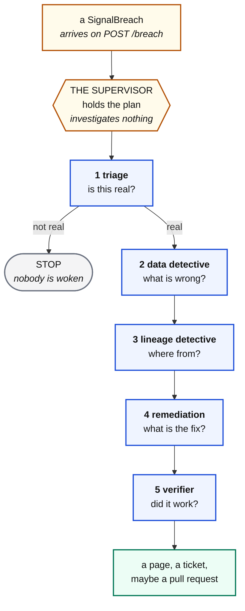

# The on call agents

Asleep until a record arrives. Then they do what a good engineer does at 3am,
without the fetching.

Built with **LangChain 1.x**, using the documented **subagents as tools**
pattern. The older `create_supervisor` helper is no longer maintained.

---

## The shape



---

## Why five and not one

> **An agent with every tool will use every tool.**

Give one agent SQL and file reading and it will read a file, form a theory, and
then go looking for numbers that agree with it. Split them and that becomes
impossible.

| Agent | Answers | Tools | Deliberately cannot |
|---|---|---|---|
| **1 triage** | is this real? | the signal board | query, or read code |
| **2 data detective** | what is wrong with the rows? | 7 read only warehouse tools | open a file |
| **3 lineage detective** | where did it enter? | 5 code and git tools | query the warehouse |
| **4 remediation** | what is the smallest fix? | the publishing tools | change data |
| **5 verifier** | did the number come back? | warehouse and board | change anything |

**The data detective cannot open a file**, so everything it reports came from a
query rather than from a theory.

**The lineage detective cannot query**, so it cannot quietly redo the previous
agent's work with worse tools.

Narrow the toolbox and the method emerges from the constraint, rather than from
a longer prompt everybody hopes the model reads.

---

## Triage is cheap, and runs first

If triage says the number moved for a boring reason, **nothing else runs**. Four
expensive agents are never woken and nobody is paged for a public holiday.

> Be willing to say no. A triage agent that says yes to everything has cost you
> the money it was there to save.

It can see the whole board, because one signal moving is a question and six
moving together is usually one cause, and often an upstream one.

---

## Every agent returns a schema

```python
class TriageVerdict(BaseModel):
    is_real: bool
    severity: str
    owner: str
    start_at: str
    reason: str
```

Prose is readable and unusable: a supervisor cannot branch on a paragraph.
`is_real` is a real python boolean, and that is what lets the whole thing stop
early and cheaply.

---

## Subagents as tools

```python
subagent = create_agent(model=..., tools=[...], response_format=DataVerdict)

@tool("investigate_data", description="Find what is wrong with the rows...")
def call_data(focus: str = "") -> str:
    result = subagent.invoke({"messages": [{"role": "user", "content": ...}]})
    return result["structured_response"].model_dump_json(indent=2)

supervisor = create_agent(model=..., tools=[call_triage, call_data, ...])
```

The specialists are **stateless** and start in a clean context every time, which
stops the fifth agent inheriting four agents' worth of noise.

The supervisor decides who is asked next, carries each answer forward, and stops
when the evidence is enough. **It investigates nothing itself.**

---

## What is deliberately not written down

There is **no list of known incidents** anywhere in this project. No prompt says
"if surge is missing, look in MongoDB". No rule maps a signal to a cause.

The agents are given a method and a toolbox, not the answers. That is why a
problem nobody has seen before is worked exactly like one that has.

---

## What it may produce

| Always | When the fix is code | When the fix touches data |
|---|---|---|
| a Confluence page, with a diagram | a branch and a **pull request** | an approval request |
| a ticket, with an owner and severity | never a merge, never main | **the graph stops** |
| | two directories only | nothing is executed, ever |

### Why a page is always produced

The most common outcome of an investigation is not a fix. It is a diagnosis,
some evidence, and a decision that belongs to somebody who was asleep.

**A system that only produces output when it is confident produces nothing on
the nights you needed it most.**

---

## The guards, and why only one of them counts

**The syntactic guard** rejects anything that is not a single SELECT. Easy to
read, easy to explain, easy to fool.

**The read only transaction** is the one that matters:

```python
conn.read_only = True
```

Postgres itself refuses the write, whatever the model asked for and however the
query was spelled.

> **Whether an agent meant well is a judgement. Whether it CAN write is a fact.**

Every rule you enforce only in a system prompt is a rule you are hoping about.

### The other three facts

**Code changes are limited to two directories.** An agent that can edit the
tests which judge it is not being judged.

**A proposed edit is parsed before a human is asked.** Whether a change is right
is a judgement; whether it compiles is a fact, and facts get checked first.

**A data change stops the graph.** `HumanInTheLoopMiddleware` pauses before the
tool runs at all, and the tool would not execute the statement even if it ran. A
person does that, by hand, having read it.

```python
middleware=[HumanInTheLoopMiddleware(interrupt_on={"request_db_change": True})]
```

Resuming takes a decision **and a reason**, and rejecting is a real outcome that
goes back to the agent. That is the difference between a human gate and a rubber
stamp.

### Why code changes do not pause

A pull request is already a human gate by construction. Pausing twice for the
same decision teaches people to click through, and a gate everybody clicks
through is worse than no gate, because it looks like control.

---

## The Confluence page

Composed **in code**, not by the model. The agent supplies eight strings; the
shape, ordering, macros and column widths are fixed.

Ask a model for Confluence storage format and you get a different page every
time, some of them broken. Assemble it yourself and every page in the space
looks the same, which is what makes a space navigable rather than a pile.

Structure, in order:

1. a summary table, as the page properties macro, so a parent page can roll them into a report
2. a provenance panel saying a machine wrote this and changed nothing
3. a table of contents
4. what happened, in two or three sentences of fact
5. **an architecture diagram** of where in the flow it breaks
6. evidence, as SQL and output in code blocks
7. what it means, in the owner's language
8. numbered steps
9. an ownership table, and a collapsed appendix

> A reader should be able to stop after the summary table and still know what to
> do. Everything below the fold is for the person who wants to check the work.

### The seam

`Publisher` is an interface with two implementations: markdown on disk, or the
Confluence REST API, chosen by whether the credentials are present. Swapping one
for the other **changes no agent code**, which is why this runs for a student
with no Atlassian account and for a team with one.

---

## Running it

```bash
uvicorn agent_service.worker:app --port 8092
```

| Endpoint | Does |
|---|---|
| `POST /breach` | the doorbell. Accepts and returns `202` at once |
| `POST /sweep` | picks up anything the doorbell missed |
| `GET /investigations` | what has been worked |
| `GET /investigations/{id}` | one investigation, with its artifacts |
| `POST /investigations/{id}/resume` | approve or reject a paused one |

**The doorbell returns immediately.** An investigation takes a minute or two, and
a scheduler that blocks for two minutes on one HTTP call has stopped being a
clock.

**The sweep exists because the doorbell is allowed to fail.** The breach is
durable before anybody is notified.

---

## The verifier actually verifies

An agent will happily tell you it fixed something. This one has to show a
pipeline that ran and a number that moved, in this order:

| Step | Tool | Answers |
|---|---|---|
| 1 | `check_file_on_disk` | is the change applied, or still on a branch? |
| 2 | `run_pipeline` | does it run, and does the number reach gold? |
| 3 | `run_invariants` | did anything else break while fixing this? |
| 4 | `get_signal` | is the number actually back? |

Step 1 is the one that matters most. **A proposal waiting for a human has fixed
nothing**, and reporting resolved because a change was proposed is how an
incident gets closed while still broken.

### Why this agent may run a pipeline when nothing else may write

Every other tool is read only, and that is load bearing, so this needs a better
argument than "the deck said so".

**The pipelines are idempotent by construction**, which is the first thing the
whole course teaches: `write_window` deletes the window it is about to rebuild
and inserts it back in one transaction. Running `p7_silver_rides` twice produces
the same table as running it once. So running a pipeline does not change the
answer, it **recomputes** it, and that is categorically different from an
`UPDATE`.

It is still fenced: only the eight pipelines, by name, with a timeout, and every
run leaves a row in `teach.runs` exactly like a human running it.

> An agent's permissions should follow from **a property of the thing it is
> allowed to do**, not from how much you trust the model.

### And a failing pipeline is sometimes correct

If the fix was a guard that refuses bad input, then the pipeline failing on that
input is the guard working. The verifier is told to tell those apart rather than
assume a non zero exit is a broken change.

---

## The worker pool

Investigations are expensive: five agents, a dozen model calls, a minute or two
each. Left unbounded, six incidents at once means six concurrent investigations,
six times the spend, and six processes competing for the same connections.

```
ONCALL_MAX_CONCURRENT=2      how many run at once
ONCALL_QUEUE_LIMIT=50        how many may wait
```

They queue rather than being refused, because a burst worked slowly is what you
want at 3am. Past the queue limit the service returns `503` and says so: the
record is already durable, and the sweep will pick it up.

`GET /health` shows both numbers, so "the agents are slow" and "the agents are
saturated" are different answers rather than the same shrug.

---

## Isolation, and the bug that made it necessary

The first version of the code change tool ran `git checkout -b` in the
project's own working tree. With one investigation it worked. With two,
reproduced in a throwaway repository:

```
thread 1: reported "committed"       its branch contained the ORIGINAL file
thread 2: reported "commit failed"   its branch contained its change
```

**A success report with no change in it.** Nobody would find that from the logs.

Each proposal now gets `git worktree add`: its own checkout, its own directory,
its own branch. Two investigations cannot see each other's files, and the tree a
human is sitting in is never touched. That is the "worktree per incident" line
in the architecture, and it is not an optimisation.

Five tests hold it in place, including one that runs three proposals
concurrently and asserts every commit is non empty.

A third bug fell out of writing them. Working the same breach twice silently
reused the existing branch, whose file **already had the change**, so the check
failed and the caller was told *"that text is not in the file"*. Untrue, and it
would send an agent hunting for a different cause. It now says the branch
already exists and does nothing. That one made the test suite flaky, which is
how it was found.

### And a second incident, from the tests themselves

Those concurrency tests call the real `propose()`. `ONCALL_REPO_PATH` pointed at
a live GitHub repository, so **running the test suite opened seven real pull
requests on it**, titled `C1`, `C2` and `x`.

Nothing failed. The tests passed. The side effect was somewhere else entirely,
which is the exact shape this project spends nineteen notebooks warning about,
committed by the project, twice.

Pushing is now blocked by two independent checks:

```python
ONCALL_ALLOW_PUSH=0    an explicit switch, set by conftest and by CI
"pytest" in sys.modules  a test run cannot reach the network regardless
```

Two rather than one on purpose: either alone would have prevented it, and
relying on one of them is how it happened. A proposal made during a test still
branches and commits, so the tool is still exercised; it just cannot leave the
machine.

> **A test that can open a pull request is not a test, it is a deployment.**

---

## Cost, roughly

One investigation is five agents and a dozen or so tool calls. On
`gpt-5.4-mini` that is cents, not dollars, and triage refusing to escalate is
what keeps it there.

Set `ONCALL_SUPERVISOR_MODEL` to something stronger than `ONCALL_MODEL` if you
want a better plan without paying for it five times.
