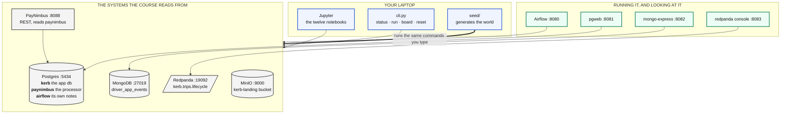
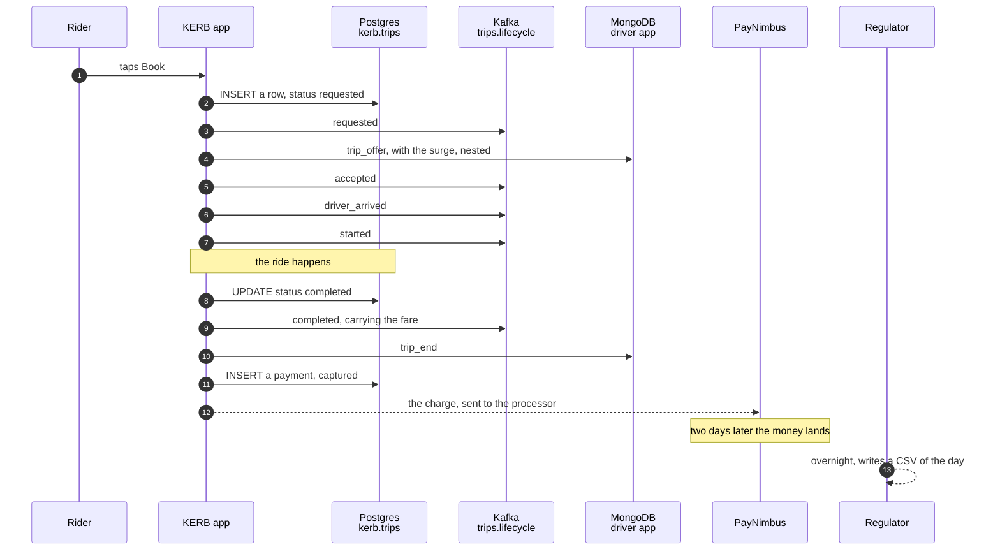
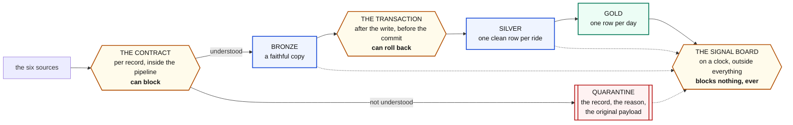
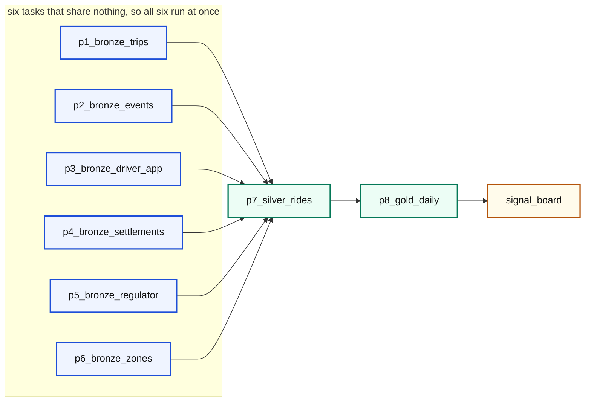

# The architecture

What is running, why it is shaped this way, and how a row travels from a source
system to a number on a finance report.

---

## The estate

Nine containers, in three groups.



### Why one Postgres holds three databases

`kerb` is the app's system of record. `paynimbus` is a different company's
ledger. `airflow` is an orchestrator's private bookkeeping.

They are separate **databases**, not separate schemas, so that nothing can
quietly join across the boundary. KERB cannot read the processor's ledger, the
same way it could not read a real processor's ledger, and the only route to that
data is the HTTP API. That constraint is the entire subject of notebook 5.

Running them on one Postgres instance is a convenience: three instances on a
laptop is a support burden nobody needs.

### Why Redpanda and not Kafka

It speaks the Kafka protocol, so every line of Kafka code in this course is real
Kafka code, and it is one container instead of three with no ZooKeeper. Swap the
broker address for a real Kafka cluster and nothing else changes.

### Why MinIO

It speaks the S3 API. The file pipeline in notebook 6 is the same code you would
write against real S3 with a different endpoint.

---

## How a ride becomes a number

One ride happens, and five systems record a different part of it. That is not a
teaching contrivance: it is what an estate looks like once more than one team
has shipped something.



Five records of one ride, and they do not agree:

| System | What it knows | What it does not |
|---|---|---|
| `kerb.trips` | the ride happened, and how it ended | the fare, the surge, whether the money arrived |
| the stream | every step, in order, with the fare | anything about payment |
| MongoDB | the surge, and which app version sent it | anything about money or zones |
| PayNimbus | whether the money actually arrived | which ride it was for |
| the regulator's file | an audited copy of yesterday | today |

**Silver exists to make those five agree.** That is the whole job.

---

## The medallion, and where the checkpoints sit



Three checkpoints, and people collapse them into one word, quality, and then
argue past each other. They are not the same thing. See
[contracts.md](contracts.md).

---

## Where the code lives

```
pipelines/
├── lib/
│   ├── config.py       every address in the system. One file, on purpose
│   └── run.py          the four rules: run log, quarantine, write_window
├── p1_bronze_trips.py         a database table
├── p2_bronze_events.py        a stream
├── p3_bronze_driver_app.py    a document store
├── p4_bronze_settlements.py   somebody else's API
├── p5_bronze_regulator.py     files in object storage
├── p6_bronze_zones.py         a dimension, replaced whole
├── p7_silver_rides.py         the join
└── p8_gold_daily.py           the aggregate
```

**One file per pipeline, and one pipeline per source.** Six sources, six bronze
pipelines. Not one pipeline with six branches, because the day one of them
breaks you want to rerun exactly that one.

**Nothing shared except `lib/`.** A pipeline that imports another pipeline has
made them one deployment, and you will find that out at the worst moment.

### config.py, and the one flag that matters

```python
load_dotenv(ROOT / ".env", override=False)
```

`override=False` means a variable already set in the environment wins. On your
laptop `.env` supplies `POSTGRES_HOST=localhost`. Inside the Airflow container,
compose supplies `POSTGRES_HOST=postgres`, and that wins.

**Not one line of pipeline code changes between the two.** Every address in the
project goes through this file for exactly that reason.

### run.py, and the four rules

Every pipeline gets these without writing them again:

```python
with Run("p1_bronze_trips") as r:        # 1. observable: a row in teach.runs
    r.rows_in = len(rows)
    r.quarantine(payload, reason)         # 2. honest: held, not dropped

    with write_window(TABLE, "trip_date", lo, hi) as cur:
        cur.executemany(INSERT, keep)     # 3. idempotent  4. atomic
```

`write_window` deletes the window it is about to rebuild and inserts the new
rows **in the same transaction**. Run it twice and you get the same table, not
double the rows. Kill it halfway and the delete rolls back with the insert, so a
reader never sees a table with a hole in it.

---

## Orchestration

`airflow/dags/teach_pipelines.py` is a real DAG in a real scheduler.



Airflow derives all of that from one line:

```python
bronze >> silver >> gold
```

And the guarantee it buys is absolute: **gold can never be built from a silver
table that failed to refresh.** Not "should not". Cannot. See
[orchestration.md](orchestration.md).

`airflow/dags/` in this repo is mounted straight into the scheduler, so saving a
file there **is** deploying it.

---

## What is deliberately not here

**No dbt, no Spark, no cloud warehouse.** Every one of them would be a
reasonable production choice and every one would hide the thing being taught.
You cannot see what `delete the window then insert it back in one transaction`
means when a tool does it for you.

**No retry framework, no circuit breaker.** They belong in a shared client. Put
them in a teaching pipeline and the lesson disappears under plumbing.

**No streaming compute.** The stream is read in batches by a pipeline that
finishes. Continuous processing is a different course.
