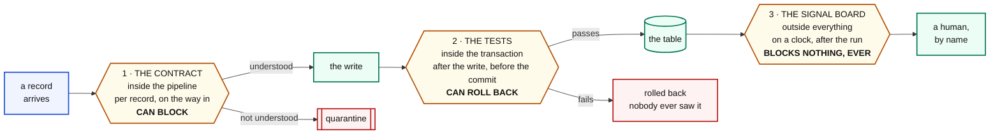
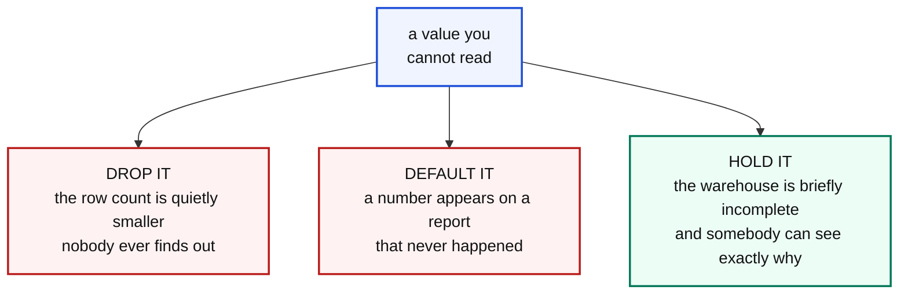

# Contracts, quarantine, and the three checkpoints

People collapse all of this into one word, quality, and then argue past each
other. There are three different things here, they sit in three different
places, and only two of them can stop anything.

---

## The three checkpoints



| | the contract | the tests | the signal board |
|---|---|---|---|
| **where** | inside the pipeline | inside the transaction | outside everything |
| **when** | per record, on the way in | after the write, before the commit | on a clock, after the run |
| **sees** | one record | the whole batch | the whole warehouse, over time |
| **can it block?** | **yes** | **yes**, it rolls back | **no. Nothing. Ever.** |
| **answers** | can I read this? | does this batch make sense? | has something moved? |

> **A check that can block a write is a contract. A check that cannot is a
> signal.**

Calling both of them monitoring is how a team ends up with alerts nobody reads
and pipelines that fail for reasons nobody wanted them to.

---

## What a contract actually is

**The set of values you already know how to interpret.**

It is not a validation rule and it is not a preference. It is a written record
of what the rest of the company has agreed a thing can be.

```python
# p1: four ways a ride can end
KNOWN_STATUS = {"completed", "cancelled_rider", "cancelled_driver", "no_driver"}

# p2: without these three, a message means nothing
REQUIRED = ("trip_id", "event", "ts")

# p3: every place this value has ever legitimately lived
SURGE_PATHS = (
    ("payload", "surge_multiplier"),
    ("payload", "pricing", "surgeFactor"),
    ("pricing", "surge_multiplier"),
    ("surge_multiplier",),
)

# p4: three answers we know how to file
KNOWN_STATUS = {"settled", "failed", "in_flight"}
```

Four pipelines, four contracts, one shape. Each is a small, readable, arguable
list, sitting at the top of the file where somebody can change it.

### A contract is a list, not a schema

`SURGE_PATHS` is the important one. It is not "the surge lives here", it is
"here is every place we are willing to read it from".

The data team wrote it expecting release 4.2 to move the field to
`pricing.surge_multiplier`. That was a reasonable guess and it was wrong. 4.2
moved it to `payload.pricing.surgeFactor`.

**You cannot predict where a field will go.** What you can do is notice, on the
day, that some records match none of your known paths.

---

## The three answers to a value you cannot read



**Two of them are lies.** Only holding is honest.

### Zero is not the same as unknown

```
surge = 0   meaning "there genuinely was no surge on this ride"   a fact
surge = 0   meaning "we could not find the field"                 a lie
```

Once written, the two are indistinguishable. Picture a report that averages
surge: every defaulted zero drags it down and quietly misprices the product, and
no check anywhere goes red.

**Holding costs you an incomplete table for a day. Defaulting costs you a wrong
number forever, with nothing to point at.**

### The same argument, with money

The payment processor sends some settlements with `status = ""`.

| | |
|---|---|
| default it to `failed` | finance **writes off money that actually arrived** |
| default it to `settled` | finance **books revenue that never came** |
| hold it | the only answer that is not a lie to somebody |

---

## Quarantine

Held records go to one table, `teach.quarantine`, with everything a human needs.

```sql
CREATE TABLE teach.quarantine (
    id         BIGSERIAL PRIMARY KEY,
    run_id     TEXT,        -- which run held it
    pipeline   TEXT,        -- which pipeline
    reason     TEXT,        -- in words a person can read
    record_key TEXT,        -- the id, so you can find it upstream
    payload    JSONB,       -- the original, unchanged
    seen_at    TIMESTAMPTZ DEFAULT now()
);
```

### The reason is written for a person

```
status 'refunded_by_support' is not one of ['cancelled_driver', 'cancelled_rider',
'completed', 'no_driver']

no surge value at any known path: payload.surge_multiplier,
payload.pricing.surgeFactor, pricing.surge_multiplier, surge_multiplier

missing required field(s): ts
```

Not an error code. Not a stack trace. A sentence naming what was expected and
what arrived, so the person who picks it up tomorrow does not have to guess.

### For a stream, keep the address

```python
run.quarantine(
    payload={"raw": m.value().decode("utf8", "replace")[:400],
             "partition": m.partition(),
             "offset": m.offset()},
    reason=str(e))
```

An offset is a **permanent address**. Keeping it means you can go straight back
to the topic and read that exact message again.

That is the difference between *"something went wrong last night"* and *"here it
is, this is the message, this is why"*.

### It is buffered, and there is a story in that

The first version of `quarantine()` opened a database connection per held
record. Forty thousand records took **212 seconds**. Batching them made it
**0.7**. Same code, same result, three hundred times faster.

The lesson is not "batch your writes". It is:

> **When something is inexplicably slow, count how many times you are opening a
> connection.**

---

## Reading the quarantine

```sql
-- what is being held, and why
SELECT pipeline, reason, count(*) AS records
FROM teach.quarantine
GROUP BY 1, 2
ORDER BY 3 DESC;

-- one held record in full
SELECT reason, payload
FROM teach.quarantine
WHERE pipeline = 'p3_bronze_driver_app'
LIMIT 1;
```

`records_held` on the signal board watches that table, with a baseline of zero.
It is the one signal that is breached on a healthy estate here, because the
payment processor genuinely does send unreadable statuses, and that is a real
open issue somebody owns rather than a bug in the board.

---

## What a contract is not

**Not a schema validator.** A schema says "this field is a string". A contract
says "these four strings are the ones we know how to file".

**Not a linter.** It runs on data, in production, every run, on values that came
from outside your control.

**Not a test.** A test runs on a batch, before the commit, and can roll the
whole thing back. A contract runs on one record and decides only that record's
fate.

**Not a place for business rules.** "A fare over 10,000 is suspicious" is a
signal, not a contract. The contract asks whether the value can be *read*, not
whether it is *plausible*. Confuse those and your pipeline starts refusing
correct data on a busy night.
