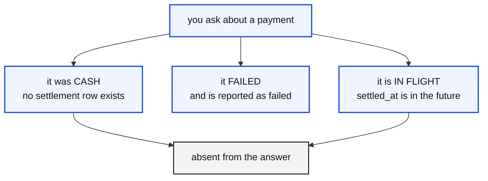

# The data

What is in each system, what the columns mean, and the incidents deliberately
hidden in the seed.

Everything is generated by `seed/`, deterministically. The same `KERB_SEED`
produces the same rides, the same fares and the same incidents on any machine,
so a number in a lesson matches the number on a student's screen.

---

## How much there is

Defaults are 30 days at 12,000 rides a day. `python -m seed --quick` gives you 7
days at 2,000, and every lesson still works.

| System | Holds | Roughly |
|---|---|---|
| Postgres `kerb.trips` | one row per ride | 365,000 |
| Postgres `kerb.payments` | one row per completed ride | 325,000 |
| Postgres `kerb.zones` | the dimension | 61 |
| Postgres `kerb.drivers` / `riders` | the people | 2,800 / 40,000 |
| `paynimbus.settlements` | one per non cash payment | 299,000 |
| MongoDB `driver_app_events` | offer and end, per ride with a driver | 686,000 |
| Kafka `kerb.trips.lifecycle` | the ride lifecycle | 1,741,000 |
| MinIO `regulator/dt=.../` | one gzipped CSV per day | 30 files |

### The dataset ends two weeks before today

Deliberately. A pipeline that asks for "the last seven days counting back from
today" reads exactly nothing, and notebook 2 walks into that on purpose before
showing you how to anchor a window on the data instead of the clock.

---

## kerb.trips

The table the whole course starts from.

| Column | Type | Notes |
|---|---|---|
| `trip_id` | TEXT PK | `TRP00000001`, in time order |
| `rider_id` | TEXT | always present |
| `driver_id` | TEXT | **NULL when nobody accepted.** An INNER JOIN here deletes those rides |
| `requested_at` | TIMESTAMPTZ | the rider taps Book. The window is built on this |
| `accepted_at` | TIMESTAMPTZ | NULL for `no_driver` |
| `arrived_at` | TIMESTAMPTZ | the driver reaches the pickup point |
| `started_at` | TIMESTAMPTZ | only for completed rides |
| `ended_at` | TIMESTAMPTZ | only for completed rides |
| `pu_zone_id` | INTEGER | **NULL for about 4 in 1,000.** They still happened |
| `do_zone_id` | INTEGER | |
| `distance_km` | NUMERIC(7,3) | log normal, so a few long rides and many short ones |
| `duration_s` | INTEGER | **seconds**, as the source has it. Silver converts to minutes |
| `status` | TEXT | one of four. This is the contract |
| `app_version` | TEXT | which release booked it |

### The four statuses, and why there are four

| Status | Share | Emits | Has a fare |
|---|---|---|---|
| `completed` | 89% | 5 events | yes |
| `cancelled_rider` | 6% | 3 events | no |
| `cancelled_driver` | 4% | 3 events | no |
| `no_driver` | 1% | 2 events | no |

A fifth appearing means either the product team shipped a state and forgot to
say, or something upstream is corrupting the field. Both are worth hearing about
on the day.

### The shape of a day

Rides cluster into a morning peak around 08:00 and an evening peak around 18:00,
and weekdays differ: Friday carries about 1.24 times a Monday, Sunday about
0.84. Plus a few percent of ordinary noise.

That variation is not decoration. Without it the `rides_per_day` signal has a
spread of zero, so either nothing ever breaches or everything does, and the
lesson in notebook 8 has nothing to demonstrate.

---

## kerb.payments

One row per completed ride. Nothing else is charged for.

| Column | Notes |
|---|---|
| `payment_type` | `upi` 52%, `card` 26%, `wallet` 14%, **`cash` 8%** |
| `status` | `captured` |
| `amount` | base 30, plus 13.5 per km, plus 1.6 per minute, times surge, floor of 45 |
| `captured_at` | seconds after the ride ends |

**Cash never reaches a processor**, so those payments have no settlement row at
all. That is one of three reasons a reference can be absent from an API answer.

---

## paynimbus.settlements

A different company's ledger, in a different database, which `kerb` has no
route to. The only way in is the HTTP API.

| Column | Notes |
|---|---|
| `settlement_id` | **their** id, not ours |
| `merchant_ref` | **our** `payment_id`. Their name for it |
| `rail` | `upi`, `card`, `wallet`. Never cash |
| `gross` / `fee` / `net` | fee is 0.8% to 2.4% |
| `status` | `settled`, `failed` 0.4%, or `in_flight` |
| `settled_at` | **T plus two days.** NULL for failed |

### Three ways a reference is absent from an answer



All three are correct and healthy states. Treat absent as a failure and you page
somebody every night for a system behaving exactly as designed.

**Status is derived, not stored.** The API computes it from `settled_at` against
`now()`, because a ledger written once at seed time would otherwise leave a
charge in flight forever while the clock moved on.

---

## MongoDB, driver_app_events

Two documents per ride that had a driver: `trip_offer` and `trip_end`.

```json
{
  "event_id": "EV000000158",
  "trip_id": "TRP00000091",
  "driver_id": "DRV002338",
  "event_type": "trip_offer",
  "ts": "2026-08-19T00:00:02",
  "app":      { "version": "4.1.5", "platform": "android", "build": 415 },
  "device":   { "model": "Samsung M14", "battery": 36, "network": "wifi" },
  "location": { "lat": 13.120018, "lng": 77.597329, "accuracy_m": 29.5 },
  "payload":  { "eta_s": 211, "distance_km": 2.72, "surge_multiplier": 1.12 }
}
```

`app`, `device`, `location` and `payload` are not values, they are more
documents. The surge value the pricing team depends on is nested inside one of
them, and **where** it is nested depends on the release.

---

## Kafka, kerb.trips.lifecycle

Three partitions. Every message is **keyed by `trip_id`**, so all the events of
one ride land on the same partition and stay in the order they happened.

| Status | Events |
|---|---|
| completed | `requested`, `accepted`, `driver_arrived`, `started`, `completed` |
| cancelled | `requested`, `accepted`, `cancelled` |
| no_driver | `requested`, `expired` |

The `completed` event carries the fare, and it is the only one that does. That
is why silver joins to events with `AND e.event = 'completed'` in the `ON`
clause.

**The average is about 4.77 events per ride**, not 5, because cancelled rides
emit fewer. That is why the signal watching it has a tolerance rather than an
exact number.

Three other topics exist and nothing reads them: `kerb.gps.pings`,
`kerb.payments.settled`, `kerb.trips.lifecycle.dlq`. A broker with exactly one
topic on it teaches people that a topic and a broker are the same thing, and
they are not.

---

## MinIO, the regulator's files

```
kerb-landing/regulator/dt=2026-08-19/trips_audit.csv.gz
```

Completed rides only, gzipped CSV, one file per day. Two details are deliberate:

**Zone ids are written as `9.0`**, because whatever produced the file held them
as floats, and `int("9.0")` raises.

**About one row in 1,200 has a value that will not convert at all.** One bad row
in a file must not throw away the rest.

---

## The incidents hidden in the seed

Three, and each is a notebook. They are load bearing: change them and the
lessons stop working.

### 1. The field that moved

Release **4.2.0** moved the surge value from `payload.surge_multiplier` to
`payload.pricing.surgeFactor`. A different name, at a different depth.

```
payload.surge_multiplier        348,524   96.4%    releases 4.0.6, 4.1.2, 4.1.5
payload.pricing.surgeFactor      12,880    3.6%    release 4.2.0
pricing.surge_multiplier              4    0.0%    <- see below
```

4.2.0 only exists in the **last stretch of the month**, because that is what a
release looks like. A version appearing evenly across a month looks like noise
and the incident stops being findable.

**Those four documents are a fingerprint.** `pricing.surge_multiplier` is the
path the data team *guessed* 4.2 would use. Somebody on the mobile team started
that refactor and changed their mind. Notebook 4 ends by finding exactly those
four.

*Taught in [notebook 4](../notebooks/04-bronze-from-documents.ipynb).*

### 2. The status that is an empty string

About 34% of resolved settlements come back with `status = ""`. Not `failed`,
not `settled`, an empty string, because the field was never set.

Money in that state can be neither recognised as revenue nor chased as missing.
Defaulting it either way is a lie to somebody in finance, so it is held.

Tunable: `PN_EMPTY_STATUS_SHARE` in `.env`. Set it to `0` for a run with nothing
held.

*Taught in [notebook 5](../notebooks/05-bronze-from-an-api.ipynb).*

### 3. The rides that are not in every source

| Missing from | How many | Why |
|---|---|---|
| the `completed` event | 11% | cancelled rides never completed |
| the driver app | varies | the document window covers the recent end only |
| settlements | most recent 2 days | settlement is T plus two |
| the zone dimension | 4 in 1,000 | never resolved to a service zone |

Every one is a real ride. An `INNER JOIN` deletes all of them and the count is
just smaller, with no error anywhere.

*Taught in [notebook 7](../notebooks/07-silver-joining-it-together.ipynb).*

---

## And one you cause yourself

```bash
python cli.py break
```

Blanks the surge value on the most recent 12,000 driver app records, exactly as
an unannounced rename would. Nothing fails, no row count changes, and
`surge_missing_pct` goes from 0 to 15.

```bash
python cli.py fix
```

*Taught in [notebook 9](../notebooks/09-break-it-and-put-it-back.ipynb).*

---

## Changing the data

```bash
python -m seed --days 60 --trips-per-day 20000 --force
python -m seed --seed 12345 --force        # a different world, same shape
python -m seed --quick --force             # 7 days of 2,000
```

Always `--force` when regenerating. It clears the Kafka topics as well as the
tables, and it has to: **a stream is not a table.** Truncating Postgres does
nothing to the broker, and leaving the previous generation's events behind gives
you a topic that disagrees with the database it is supposed to describe.
