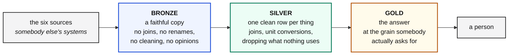
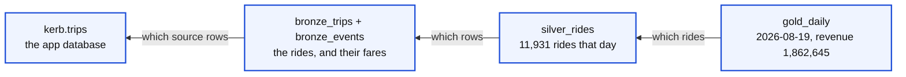

# Bronze, silver, gold

Three layers. The names come from a convention called the medallion
architecture, and the names do not matter. **The discipline does.**

Each layer is allowed to do things the layer before it was not, and that
escalation is the entire idea.

---

## Bronze: a copy with no opinions

**One bronze table per source table.** Same columns, same values, same names.

### What bronze may not do

| Not allowed | Why |
|---|---|
| join | a join is an opinion about how two things relate |
| rename a column to something nicer | now nobody can find it in the source |
| clean a value | now nobody knows what the source sent |
| aggregate | you have thrown away the rows you cannot get back |

### The one thing bronze may do

**Refuse a record it cannot read.** A value nobody can interpret is held rather
than landed, because landing a value nobody can interpret is not faithfulness,
it is just deferring the problem. See [contracts.md](contracts.md).

### Why the rules are this strict

Because the moment bronze starts having opinions, you can no longer answer one
question:

> Is this wrong because the source sent it wrong, or because we broke it on the
> way in?

**Bronze exists so that question always has an answer.** Everything else about
the layer follows from that one sentence.

### Bronze is where the awkwardness lives

Six sources, six different ways of being awkward, and every one of them is a
notebook:

| Source | Awkward because |
|---|---|
| a database table | enormous, so you take a window |
| a stream | your position lives on the broker, not in your database |
| a document store | no schema, so every release can change the shape |
| a partner API | answers late, partially, or not at all |
| files | no types. Everything is a string |
| a reference table | not a fact, so it is rebuilt whole rather than windowed |

---

## Silver: one clean row per thing

Bronze gives you five tables shaped like five different systems. **Nobody
outside the team can use any of them.**

Silver is one row per ride, with everything attached, and it is the first table
a stranger could read.

### What silver may do that bronze may not

| Allowed | Example here |
|---|---|
| **join** | five bronze tables into one row per ride |
| **convert units** | `duration_s` becomes `duration_min` |
| **derive columns** | `is_settled`, a plain yes or no, so nobody downstream guesses |
| **resolve ids** | `pickup_zone` 42 becomes `Koramangala`, because an id nobody can read is not an answer |
| **drop** | no `rider_id`. Carrying a personal identifier nothing uses is a liability, not an asset |

### The grain is the decision

**One row per ride.** Say it out loud before writing the query, because
everything else follows from it.

`bronze_events` holds five rows per ride. Joining it without care gives you five
silver rows per ride, every aggregate is five times too big, and the bug looks
like a pricing problem rather than a join problem. That is why the join to
events carries `AND e.event = 'completed'` in the `ON` clause: it picks exactly
one row.

### Silver keeps the gaps

A ride with no fare, no surge and no settlement is still a row in silver, with
nulls in those columns.

**Those gaps are the truth, not a bug.** A cancelled ride has no fare because it
was never charged. A recent ride has no settlement because settlement is T plus
two days. Reporting 100% completeness everywhere would mean somebody is not
looking.

---

## Gold: the answer

One row per day, per zone, per whatever the question is.

### The test for a gold column

> If you cannot say the column name out loud in a sentence to a finance manager,
> it does not belong.

`avg_duration_min` passes. `duration_s` does not, because nobody asks how many
seconds a ride was. `rides` passes. `trip_id` does not, because a gold table is
not about one ride.

### Gold is where you are allowed to be opinionated

Bronze had none. Silver had a few. Gold is nothing but opinions: what a day
means, what counts as cancelled, whether revenue includes tips. Those are
business decisions, they belong here, and they belong written down.

---

## How each layer is rebuilt

This is the practical difference, and it is a size decision rather than a
principle.

| Layer | Rebuilt | Why |
|---|---|---|
| `bronze_trips` | one **window** of days | millions of rows. You never touch all of them |
| `bronze_events` | **append**, keyed | a stream. The key makes a replay harmless |
| `bronze_zones` | **entirely** | sixty one rows. Replacing them all is free |
| `silver_rides` | **entirely** | eighty thousand rows, under a second |
| `gold_daily` | **entirely** | thirty rows, milliseconds |

Silver and gold are full rebuilds here because the tables are small and being
clever would cost more in explanation than it saves in runtime. When they reach
tens of millions of rows they grow a window, exactly as bronze has one.

> **Match the technique to the size, and say out loud which one you chose.**

---

## Walking backwards

The property all of this exists to give you.

A number in gold, back to the rows in silver, back to the rows in bronze, back
to the source. At no point do you have to guess, because no layer threw anything
away that the layer before it had.

That is what the discipline buys, and it is the only reason anybody puts up with
having three tables where one would do.
