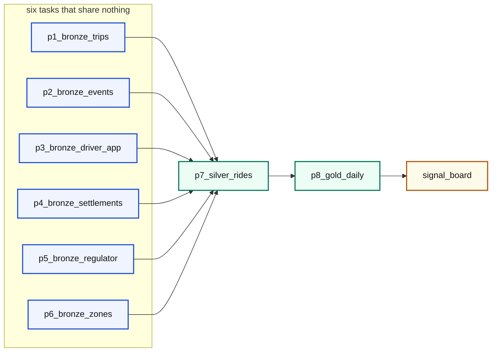
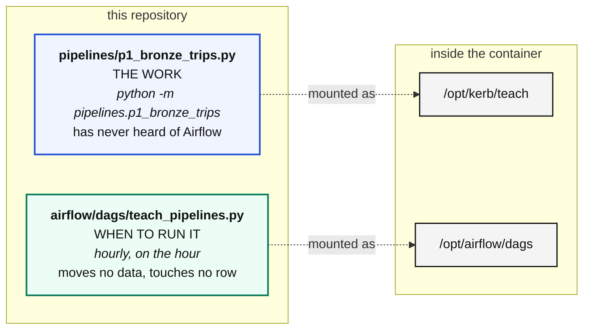

# Orchestration with Airflow

> **Airflow is a program whose only job is to start other programs, in the right
> order, at the right time, and to remember what happened.**

It does not move data. It never touches a row. Every pipeline in this course
would run perfectly well if you typed the commands by hand at the right moments,
forever, without sleeping.

**Airflow is the thing that does the typing.**

---

## Why not a for loop

`cli.py` already runs the eight pipelines in order, and on a laptop that is
genuinely enough. It stops being enough the moment you ask any of these.

| The question | What a for loop answers |
|---|---|
| The third one failed at 3am. Did the rest still run? | *no, I stopped* |
| I want to retry just that one. How? | *rerun everything* |
| Six of these are independent. Why are they queued? | *because I am a loop* |
| Yesterday's file arrived late. Can I rerun just yesterday? | *no* |
| Who was told, and about which task? | *nobody, and nothing* |

Airflow answers all five. **That is the entire reason it exists.**

---

## What a DAG is

Three words for one idea:

| | |
|---|---|
| **D**irected | the arrows point one way. Bronze feeds silver, never back |
| **A**cyclic | no loops. Nothing can end up waiting for itself |
| **G**raph | a set of tasks with arrows between them |

**A DAG is a picture of what has to happen before what.** That is all.



Nobody drew that. Airflow derived every arrow from one line:

```python
bronze >> silver >> gold
```

And the guarantee it buys is absolute:

> **Gold can never be built from a silver table that failed to refresh.**

Not "should not". *Cannot.* If silver fails, Airflow does not start gold. There
is no code path where it happens, and that one property is why people put up
with running Airflow at all.

The six bronze tasks share nothing, so Airflow runs all six at once. You can see
it in the timestamps: they all start in the same second.

---

## Two files, and where each one lives

This is the part that confuses people.



Both folders are in this repo and both are mounted into the scheduler.
**Saving a file in `airflow/dags/` is deploying it.** There is no build step and
nothing to copy anywhere.

```bash
python cli.py deploy       # only asks the scheduler to look now, rather than in 5 minutes
```

---

## Reading the DAG

Every argument answers a question.

```python
@dag(
    dag_id="teach_pipelines",
    schedule="0 * * * *",                        # how often? hourly, on the hour
    start_date=pendulum.datetime(2026, 8, 1, tz="UTC"),
    catchup=False,                               # backfill everything missed? NO
    max_active_runs=1,                           # can two runs overlap? no
    default_args={"retries": 2,
                  "retry_delay": pendulum.duration(minutes=1)},
)
```

| | |
|---|---|
| `schedule` | how often |
| `start_date` | from when does that schedule apply |
| `catchup` | if I enable this today, backfill everything since `start_date`? |
| `max_active_runs` | can two runs overlap? Not for a pipeline that rebuilds a window |
| `retries` | how many times before we admit it is broken |
| `retry_delay` | wait, so a briefly busy database recovers instead of being hammered |

### catchup is the one that bites people

Leave it `True` with a start date six months ago and enabling the DAG launches
several hundred runs at once, against production, immediately.

---

## What a task is, and what it is not

```python
BashOperator(
    task_id="p1_bronze_trips",
    bash_command=f"cd {PROJECT} && python -m pipelines.p1_bronze_trips --days 7",
    env={"PYTHONPATH": PROJECT},
    append_env=True,
)
```

It is **not a copy of the pipeline logic**. It runs the exact command you would
type yourself, and two things follow:

**Any Airflow failure reproduces on your laptop** by running one line. There is
no *"it only breaks in Airflow"*.

**The pipelines have never heard of Airflow.** Swap it for something else
tomorrow and not one pipeline file changes.

---

## A schedule is a declared cadence

Not a process sitting in a loop. A paused DAG still knows exactly when it would
run:

```bash
docker exec nightshift-airflow airflow dags next-execution teach_pipelines
```

Notebook 12 builds a one minute DAG from scratch, asks that question while it is
still paused, then unpauses it and waits for a run whose id begins
`scheduled__` rather than `manual__`. Nobody triggered it. A cron expression in
a file said it should, and the scheduler agreed.

### ran_at is not the same as the slot

The tiny pipeline in notebook 12 writes both:

| Column | Means |
|---|---|
| `ran_at` | when the machine did the work |
| `slot` | which minute the work was **for** |

A run that starts at 03:07 because the scheduler was busy is still rebuilding
the 03:00 window. Every pipeline in this course takes its window from the data
or from the slot, **never from `now()`**, for exactly that reason.

---

## The CLI, which is the same one you would use on a real scheduler

```bash
docker exec nightshift-airflow airflow dags list
docker exec nightshift-airflow airflow dags list-import-errors
docker exec nightshift-airflow airflow tasks list teach_pipelines --tree
docker exec nightshift-airflow airflow tasks test teach_pipelines p6_bronze_zones 2026-09-01
docker exec nightshift-airflow airflow dags trigger teach_pipelines -r my_run
docker exec nightshift-airflow airflow tasks states-for-dag-run teach_pipelines my_run
docker exec nightshift-airflow airflow dags unpause teach_pipelines
docker exec nightshift-airflow airflow dags pause teach_pipelines
```

**`list-import-errors` is the one people skip.** A DAG file that raises on import
does not become a broken DAG, it becomes **no DAG at all**, and that is the only
place it is reported.

---

## In the UI, at http://localhost:8080

`kerb` / `kerb_local_dev`.

| Where | What it shows |
|---|---|
| **Grid** | one column per run, one square per task, green or red |
| **Graph** | the six bronze tasks side by side, then silver, then gold |
| a red square, then **Logs** | that pipeline's own output, unchanged |
| **Clear** on one task | reruns just that task, and everything downstream |
| **Next Run** | the next slot |

That **Clear** button is the answer to *"the third one failed at 3am, how do I
retry just that?"*

---

## What Airflow does not do

Worth saying plainly, because people expect more than it gives:

- it does **not** move your data. Your code does
- it does **not** know whether your data is correct. That is the signal board
- it does **not** make a bad pipeline good. It runs it on time and tells you it
  failed

And the last task in the DAG runs the signal board **without failing the run**
when a signal breaches, because a number moving is not the same as a run being
broken. See [signals.md](signals.md).
