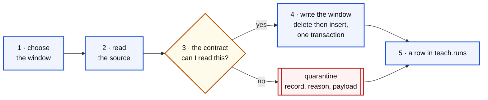
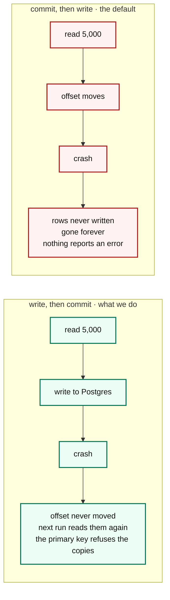
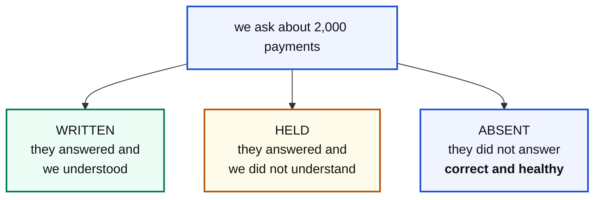

# The eight pipelines

One section each. Every one names what it reads, what it writes, the one idea it
exists to teach, and the trap it walks you into.

Every file is divided by markers like this, and the notebooks read those markers
straight out of the file, so the lesson and the code cannot drift apart:

```python
# ══ STEP 3 · Check every record against the contract ══
```

---

## The shape they all share



Six sources, six different ways of being awkward, one shape.

---

## p1 · bronze_trips, from a database

| | |
|---|---|
| **reads** | `kerb.trips` in Postgres |
| **writes** | `teach.bronze_trips` |
| **teaches** | windows, and delete-then-insert in one transaction |
| **notebook** | [2](../notebooks/02-bronze-from-a-database.ipynb) |

The source is a live table serving riders and drivers. We are guests: we read a
window of recent days and never write.

### The trap: choosing the window

The obvious answer is "the last seven days counting back from today", and it is
wrong twice over.

```sql
-- wrong: a dataset generated once has nothing near today. You read zero rows
--        and spend twenty minutes wondering why
WHERE requested_at >= current_date - interval '7 days'

-- wrong: one stray test row dated next year drags the anchor to a day that
--        holds a single ride
WHERE requested_at >= (SELECT max(requested_at) FROM kerb.trips) - interval '7 days'

-- right: anchor on the newest day that actually looks like a day of trading
SELECT date(requested_at) FROM kerb.trips
GROUP BY 1 HAVING count(*) > 100
ORDER BY 1 DESC LIMIT 1
```

### The rule to say out loud

**`lo` is inclusive. `hi` is exclusive. Always.**

Never `BETWEEN`, which is inclusive at both ends. A pipeline that double counts
one day every run is nearly impossible to spot, because every total looks
*almost* right.

### The contract

```python
KNOWN_STATUS = {"completed", "cancelled_rider", "cancelled_driver", "no_driver"}
```

Four ways a ride can end. A fifth appearing means either the product team
shipped a state and forgot to say, or something upstream is corrupting the
field. Both are things to hear about on the day.

---

## p2 · bronze_events, from a stream

| | |
|---|---|
| **reads** | Kafka topic `kerb.trips.lifecycle` |
| **writes** | `teach.bronze_events` |
| **teaches** | consumer groups, at-least-once, and the order of the last three lines |
| **notebooks** | [3](../notebooks/03-bronze-from-a-stream.ipynb) and [10](../notebooks/10-kafka-from-scratch.ipynb) |

### The primary key is a statement about the real world

```sql
PRIMARY KEY (trip_id, event)
```

A given ride can only ever have one `completed` event. Saying that in the table
definition means the database itself refuses a duplicate. No deduplication code
to write, and none to forget.

### The one line that matters

```python
"enable.auto.commit": False
```

By default the Kafka library saves your position **on a timer, in the
background**, whether or not your database write succeeded. Picture the order:

1. the library reads 5,000 messages
2. its timer fires and saves *"I have read up to here"*
3. your process dies before writing them to Postgres

Those messages are **gone**. Not delayed. Gone. No error, no gap, nothing that
any check can detect.

### So the order of the last three lines is the whole lesson



> **Duplicates you can remove. Missing data you cannot invent.**

That is at-least-once delivery, and it only works because the table refuses the
second copy.

### The pipeline also proves the broker is there

```python
consumer.list_topics(TOPIC_RIDES, timeout=10)
```

Without that line a broker that is down looks exactly like a topic you have
caught up with: `consume()` returns nothing, the loop ends, and the run reports
success having moved zero rows. That is the precise failure this course argues
against, so the pipeline is not allowed to commit it.

---

## p3 · bronze_driver_app, from documents

| | |
|---|---|
| **reads** | MongoDB `kerb_app.driver_app_events` |
| **writes** | `teach.bronze_driver_app` |
| **teaches** | nested paths, a field that moved, and why zero is not unknown |
| **notebooks** | [4](../notebooks/04-bronze-from-documents.ipynb) and [11](../notebooks/11-mongodb-live.ipynb) |

### The contract is a list of places

```python
SURGE_PATHS = (
    ("payload", "surge_multiplier"),          # 4.0.6, 4.1.2 and 4.1.5
    ("payload", "pricing", "surgeFactor"),    # 4.2.0
    ("pricing", "surge_multiplier"),          # what we GUESSED 4.2 would do
    ("surge_multiplier",),                    # the old flat shape
)
```

The second and third entries are the lesson. The data team wrote this contract
expecting release 4.2 to move the value to `pricing.surge_multiplier`. It was a
reasonable guess and it was wrong: 4.2 moved it to
`payload.pricing.surgeFactor`, a different name at a different depth, and
exactly four documents landed at the guessed path before somebody changed their
mind.

**You cannot predict where a field will go.** What you can do is notice, on the
day, that some documents match none of your known paths, because those documents
are in quarantine with the reason attached.

### The failure this prevents

| | |
|---|---|
| the pipeline does not fail | it reads the document fine |
| the rows still land | the count is unchanged |
| surge is just empty | on some rows, starting Tuesday |
| nobody notices | for three weeks |

**Every row count check you can write stays green through that.**

### Zero is not unknown

When no path matches, the record is **held**. It is not written with `surge = 0`.

```
surge = 0  meaning "there genuinely was no surge"      a fact
surge = 0  meaning "we could not find the field"       a lie
```

Once written the two are indistinguishable. Holding costs you an incomplete
table for a day. Defaulting costs you a wrong number forever, with nothing to
point at.

### And read the source from the right end

```python
collection.find({"event_type": "trip_offer"}).sort("ts", -1).limit(limit)
```

A collection hands back its **oldest** documents first, and the oldest documents
describe rides that fell out of the bronze window weeks ago. Read from the wrong
end and every column you worked for arrives full of nulls in silver, with no
error anywhere. This was a real bug in this repo, found only by checking how
full the silver columns actually were.

---

## p4 · bronze_settlements, from somebody else's API

| | |
|---|---|
| **reads** | PayNimbus, over HTTP |
| **writes** | `teach.bronze_settlements` |
| **teaches** | three outcomes rather than two, batching, timeouts |
| **notebook** | [5](../notebooks/05-bronze-from-an-api.ipynb) |

### Three outcomes, and the third is where people go wrong



A charge still in flight is simply not in the response. It is not an error and
it is not a null. Treat absent as a failure and you page somebody every night
for a system behaving exactly as designed.

The three numbers always add up to what you asked for. If they ever do not, you
have a bug, and you can see it in one line.

### The batch size is a decision, not a detail

```python
BATCH = 250
```

One HTTP call per payment is thousands of round trips against a partner's
system, which is an accidental denial of service on a company you have a
contract with. One call for all of them is long enough to hit a timeout, and a
failure costs you everything.

250 is a trade between round trips and blast radius, and it lives in a named
constant so it can be argued about.

### The timeout is not optional

```python
urllib.request.urlopen(request, timeout=30)
```

Without it, a partner that hangs takes your pipeline with it, forever, silently.

### And the status that costs real money

The processor sends some settlements with `status = ""`. Not `failed`, not
`settled`, an empty string, because the field was never set.

```
default it to failed     finance writes off money that actually arrived
default it to settled    finance books revenue that never came
hold it                  the only answer that is not a lie to somebody
```

---

## p5 · bronze_regulator, from files

| | |
|---|---|
| **reads** | gzipped CSV in MinIO, `regulator/dt=YYYY-MM-DD/` |
| **writes** | `teach.bronze_regulator` |
| **teaches** | no types in a CSV, and no file versus empty file |
| **notebook** | [6](../notebooks/06-bronze-from-files-and-a-dimension.ipynb) |

### The date lives in the path

```
regulator/dt=2026-08-19/trips_audit.csv.gz
```

Parsed from there, never from `now()`. A file that arrives three days late is
still Tuesday's file, and everything downstream depends on that being true.

Sorting by object name sorts by date, because the date is in ISO order. That is
not luck, it is what the `dt=YYYY-MM-DD` convention buys you.

### Never list a bucket without a prefix

A production landing bucket has millions of objects. Listing all of them to find
yesterday's is how you get a very slow pipeline and a very large bill.

### A CSV has no types

```python
int("9.0")     # ValueError
```

The regulator writes zone ids as `9.0` because whatever produced the file held
them as floats. So every conversion goes through `float` first, and every
conversion is wrapped, because one malformed row in a file of a thousand must
not throw away the other nine hundred and ninety nine.

### Keep the file the row came from

```sql
source_file TEXT NOT NULL
```

The column people forget, and the one that saves you. When a number looks wrong
in six weeks, *"which file did this row come from"* is the first question
anybody asks. Without it the answer is a shrug.

### No file is not the same as an empty file

```
no file      the regulator's job failed. Somebody should call them
empty file   the regulator ran and had nothing to send. Fine
```

They look identical in a row count. A pipeline that treats them the same will
either page you every quiet weekend or stay silent through a real outage, so
count **files** as well as rows.

---

## p6 · bronze_zones, a dimension

| | |
|---|---|
| **reads** | `kerb.zones`, 61 rows |
| **writes** | `teach.bronze_zones` |
| **teaches** | facts versus dimensions |
| **notebook** | [6](../notebooks/06-bronze-from-files-and-a-dimension.ipynb) |

The first thing in the course that is not a fact.

| | a fact | a dimension |
|---|---|---|
| example | `bronze_trips` | `bronze_zones` |
| is about | something that **happened** | something that **is** |
| has a date | yes | no |
| rebuilt | one **window** at a time | **entirely**, every run |
| because | millions of rows | sixty one rows |

Delete everything, insert everything, commit once. **The transaction still
matters**, for the same reason it always does: a reader who queries halfway
through must never see an empty table.

### What a full snapshot loses

History. Rename a zone and the old name is gone, with nothing recording that it
ever existed. That is usually fine for reference data. When it is not, the
technique is called a **slowly changing dimension**: worth having heard the
phrase, not worth building today.

---

## p7 · silver_rides, the join

| | |
|---|---|
| **reads** | all five bronze tables |
| **writes** | `teach.silver_rides` |
| **teaches** | `LEFT` versus `INNER` as silent data loss |
| **notebook** | [7](../notebooks/07-silver-joining-it-together.ipynb) |

### The most expensive word in this job

Every join is a `LEFT JOIN`, and every one is deliberate. Count what changing
them would cost:

| Change it to INNER and you delete | Which are |
|---|---|
| rides with no `completed` event | every cancelled ride |
| rides with no driver app record | rides outside the document window |
| rides with no settlement | the last two days, every run, because settlement is T+2 |
| rides that never resolved to a zone | about four in a thousand |

A cancelled ride **is** a ride. An unreported ride **happened**. Money that has
not settled **will**. And a ride with no zone id **still carried somebody
somewhere**.

> **No error. No failed run. No log line. The number is just smaller.**

Somebody changes a join to make a query faster, the ride count drops four
percent, and it takes three weeks to notice and a day to find. A wrong answer
that runs successfully is worse than a crash, because a crash tells you.

### ON, or WHERE. Not a style choice.

```sql
-- correct
LEFT JOIN teach.bronze_events e
       ON e.trip_id = t.trip_id
      AND e.event = 'completed'

-- an inner join wearing a disguise
LEFT JOIN teach.bronze_events e
       ON e.trip_id = t.trip_id
    WHERE e.event = 'completed'
```

The `WHERE` runs **after** the join. The `LEFT JOIN` carefully kept the rides
with no completed event and gave them `NULL`, and then the `WHERE` threw every
one of those rows away. Same rows lost as an `INNER JOIN`, with a `LEFT JOIN`
sitting in the query looking reassuring.

### Three things silver may do that bronze may not

| | |
|---|---|
| `duration_s` became `duration_min` | a unit conversion |
| `fare`, `surge`, `settled_net` | columns that existed in no single source |
| no `rider_id` | dropped. Carrying a personal identifier nothing uses is a liability, not an asset |

---

## p8 · gold_daily, the answer

| | |
|---|---|
| **reads** | `teach.silver_rides` |
| **writes** | `teach.gold_daily`, one row per day |
| **teaches** | aggregation, and what belongs in a gold table |
| **notebook** | [8](../notebooks/08-gold-and-the-signal-board.ipynb) |

### The test for a gold column

> If you cannot say the column name out loud in a sentence to a finance manager,
> it does not belong.

`avg_duration_min` passes. `duration_s` does not. `rides` passes. `trip_id` does
not, because a gold table is not about one ride.

### FILTER, not three queries

```sql
count(*) FILTER (WHERE status = 'completed')        AS completed,
count(*) FILTER (WHERE status LIKE 'cancelled%')    AS cancelled,
```

Counts only the matching rows, in the same pass as everything else. The
alternative is three queries joined together, which is slower and much harder to
read.

### Two details worth a minute

**`avg()` ignores nulls by itself.** `avg_surge` is the average across rides that
*have* a surge value, not across all rides with the missing ones counted as
zero.

That has a consequence you will watch happen in notebook 9: when a field goes
missing upstream, this number does **not** drag downwards. The population behind
it shrinks instead, silently, which is harder to see rather than easier.

**`coalesce(sum(fare), 0)`** because `sum()` of nothing is `NULL`, not zero, and
a day with no fares should report `0` revenue rather than an empty cell.

### Why a full rebuild is fine here

Thirty rows. Milliseconds. Anything cleverer is complexity nobody is paying for.

The honest rule is not *"always full rebuild"*, it is: **match the technique to
the size, and say out loud which one you chose.**
