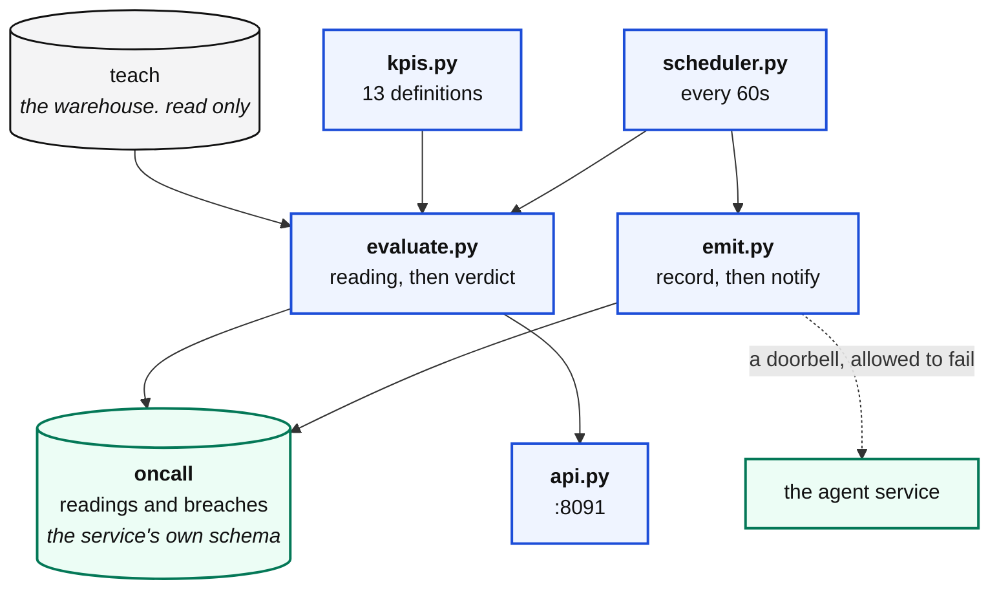
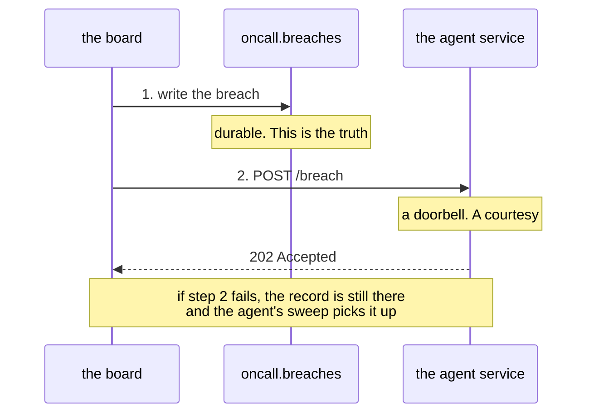

# The signal board, as a service

You already have `signals/board.py`. It works, and you run it by typing a
command. That is fine for a laptop and useless at 3am.

A service is three things the command is not: **it answers questions over HTTP,
it runs on a clock, and it keeps what it saw.**



---

## A KPI is not a signal

The distinction the whole service rests on, and the reason most alerting is
useless.

|  | a KPI | a signal |
|---|---|---|
| is | a number with a definition and an owner | a KPI, plus a baseline, plus a tolerance |
| example | "revenue yesterday" | "revenue yesterday, normally 1.9 million" |
| can be wrong | no | it can breach |
| can fire | **never** | **that is its whole job** |

> You cannot alert on a KPI, because a number on its own has no opinion about
> itself. You can only alert once somebody has written down what normal looks
> like, and that sentence is the part nobody wants to write.

---

## The rules for a KPI

**One query, one number.** If it returns a table it is a report. If it returns
two numbers it is two KPIs.

**An owner who exists.** A person or a named team. "the data team" is not an
owner, it is a way of making sure nobody looks.

**`means` written for the owner**, not for you. They will read it at 3am having
never seen the code.

**It reads the warehouse, never a source.** A KPI that queries `kerb.trips`
directly is competing with riders for the app database, which is the thing the
warehouse was built to stop.

---

## The thirteen, in four groups

They answer the four questions that actually go wrong.

### Did the work happen

| KPI | Owner | Baseline | Catches |
|---|---|---|---|
| `pipelines_failing` | data-platform | 0, a rule | work that did not happen |
| `warehouse_lag_hours` | data-platform | 0 give or take 30 | pipelines running and reading nothing |
| `records_held` | data-platform | 0, a rule | a contract refusing things |

`pipelines_failing` does not look at a single row of business data. **A pipeline
that never ran leaves perfectly valid rows behind**, every value correct, every
value old, and no check of values will ever notice.

### Is the volume right

| KPI | Owner | Baseline |
|---|---|---|
| `rides_per_day` | operations | from history |
| `revenue_per_day` | finance | from history |
| `events_per_ride` | streaming | 4.7 give or take 1 |

### Is the shape right

| KPI | Owner | Baseline |
|---|---|---|
| `completion_rate` | operations | from history |
| `cancellation_rate` | operations | from history, upward only |
| `avg_fare` | pricing | from history |

### Is anything missing

| KPI | Owner | Baseline |
|---|---|---|
| `surge_coverage_pct` | pricing | 100 give or take 1, downward only |
| `fare_coverage_pct` | finance | 100 give or take 2, downward only |
| `zone_coverage_pct` | operations | 99.6 give or take 2, downward only |
| `settlement_coverage_pct` | finance | 100 give or take 40, downward only |

**Read `surge_coverage_pct`'s tolerance.** One point, not five. In normal
operation this KPI is exactly 100.0, because the pipeline holds a record it
cannot read a surge value from rather than writing a null. Any drop is a real
change, and a generous tolerance lets a release move a field and stay under the
bar until it has affected weeks of rides.

### Direction matters

Held records going **up** is a problem. Held records going **down** is a
Tuesday. A KPI that fires on good news trains people to ignore it, so every KPI
declares which direction is bad.

---

## Two kinds of baseline

**Computed from history.** The mean of previous readings, with a z score against
the spread. Breaches past four spreads.

Why four and not two: a z of 2 fires on a quiet Tuesday, a z of 4 fires when
something broke. Set it too tight and the board cries wolf, people stop reading
it, and you have built something that made you **less** safe than nothing.

**Decided by a person.** Zero held records is not an average, it is a rule.

**And one needs both.** `events_per_ride` has a fixed baseline of 4.7 with a
tolerance of 1.0, because a completed ride emits five events and a cancelled one
emits three. Set that baseline to exactly 5 and the board breaches on day one
for a perfectly healthy system.

---

## Measuring and judging are separate

They fail for different reasons.

```python
reading = read(kpi)        # runs the query. Fails when the database is down
verdict = judge(kpi, reading)   # arithmetic. Cannot fail
```

Keeping them apart means **"the KPI could not be measured"** and **"the KPI was
measured and it is wrong"** are different outcomes, and only the second is worth
waking somebody for.

### The bug worth knowing about

`evaluate_all` shares one connection across all thirteen KPIs, which is right:
thirteen connections every minute forever is waste.

But a failing query **aborts the whole transaction in Postgres**, and every KPI
after it dies with `current transaction is aborted`. One bad query silenced
twelve good numbers, until:

```python
except Exception as e:
    conn.rollback()        # one poison KPI must not block the rest
```

Same rule as one poison message on a topic.

---

## The API

```bash
uvicorn signal_service.api:app --port 8091
```

| Endpoint | Does | Side effects |
|---|---|---|
| `GET /health` | alive, and can it see the warehouse | none |
| `GET /kpis` | the catalogue | none |
| `GET /kpis/{name}` | one definition, **including the query** | none |
| `GET /signals` | evaluate everything | **none** |
| `GET /signals/{name}` | evaluate one | none |
| `GET /signals/{name}/history` | what it has been doing | none |
| `POST /evaluate` | evaluate, record, and raise breaches | **wakes people** |
| `GET /breaches` | what breached, and what came of it | none |

**`GET` never has a side effect.** A dashboard refreshing every ten seconds must
not be able to page somebody. If measuring had side effects you would have built
a machine that alerts on being observed.

**The query is not a secret.** Anybody arguing with a number deserves to see how
it was produced. Hiding it is how a metric becomes folklore.

---

## The clock

```bash
python -m signal_service.scheduler --every 60
```

**Why a loop and not cron.** Cron is fine and often right. A loop holds one thing
cron cannot: the memory of what it has already raised. Suppression, backoff and
"this is the fourth time tonight" need state that survives between cycles, and a
process that exits every minute has none.

**Why it never dies.** Every cycle is wrapped. If the warehouse is down it says
so, waits, and tries again. A scheduler that stops on the first error is a
scheduler that was running yesterday.

**Why it is not the API.** A dashboard hammering `/signals` must not slow the
clock, and a slow clock must not make the dashboard time out.

---

## Correlate before you page

Suppression stops the same breach being raised twice. **Correlation stops one
cause being raised six times**, and it is the difference between a service that
scales and one that becomes the outage.

Thirteen signals watch one warehouse. When a pipeline dies, this happens in a
single cycle:

```
pipelines_failing        1        the pipeline failed
warehouse_lag_hours     26        so gold is a day behind
rides_per_day        4,102        so yesterday looks quiet
revenue_per_day    612,000        so revenue looks down
fare_coverage_pct     71.2        so fares look missing
records_held         3,140        and the held pile grew
```

Six records means six investigations, six pages, six tickets, six times the
model spend, and a person who has to work out they are the same thing before
they can start.

### The rules, in order

| | Rule | Because |
|---|---|---|
| 1 | more than half the board moved | that is never six separate problems |
| 2 | `pipelines_failing` or `warehouse_lag_hours` moved | every other number is downstream of work that did not happen |
| 3 | signals watching the same table moved together | they are one story about that table |
| 4 | otherwise | separate incidents, one each |

Rule 2 earns its keep. If the pipeline did not run, then rides, revenue and
coverage are all wrong **because of that**, and investigating them separately is
five wasted investigations that end at the same sentence.

The rules are deliberately conservative: **a rule that groups two genuinely
separate problems is worse than one that misses a grouping**, because the second
costs money and the first costs a missed incident.

```bash
python cli.py incidents

  incident         lead signal            sev       signals  status     owners
  INCA8AD829398    pipelines_failing      critical        4  diagnosed  data-platform, finance, pricing
```

The agent receives the incident with the lead signal and the others attached as
corroboration, which is also better evidence: six signals moving together says
far more than one moving alone.

---

## Invariants: the middle checkpoint

A signal watches a number that is **usually** in a range. An invariant is a
statement that is **never** allowed to be false.

```bash
python cli.py invariants
curl localhost:8091/invariants
```

Seventeen of them, across four layers. Every one is a query that returns **the
rows that violate it**, so a failure hands you the evidence rather than a
boolean and a hunt.

| Layer | Examples |
|---|---|
| bronze | a ride appears once; every status is one of the four agreed ones |
| silver | one row per ride; silver loses no rides and invents none; no negative fare |
| gold | the aggregate equals the rows underneath it; parts never exceed the whole |
| platform | no run stuck at "running"; every held record has a reason |

**A signal that fires is a question for a human. An invariant that fires is a
defect.** If you find yourself wanting to write "usually" into one, it is a
signal and it belongs in `kpis.py`.

---

## Suppression

The board runs every minute. A broken pipeline stays broken for hours. Without
something, one incident becomes 288 investigations a day and the thing you built
to help becomes the outage.

```python
def fingerprint(self) -> str:
    raw = f"{self.kpi}|{self.direction}|{round(self.value, 3)}"
    return hashlib.sha256(raw.encode()).hexdigest()[:16]
```

**The same KPI breaching the same way is the same incident.** The store refuses
to open a second one within a window.

---

## The record, and the doorbell

Two things happen when a signal breaches, and they are not the same.



Do them in that order and a failed notification costs **latency**, not an
incident. Do it the other way round and a restart at the wrong second means a
breach nobody ever hears about, with no error anywhere.

That is the same argument as writing rows before committing a Kafka offset.

---

## The record itself

`events/contract.py`, in a package **neither service owns**. The moment one side
owns the shape, the other is a client rather than a peer, and changing it becomes
a negotiation.

Everything the agent needs to start is in it. If the agent has to call back to
ask what happened, the record is incomplete.

| Field | Answers |
|---|---|
| `kpi`, `value`, `baseline`, `direction`, `deviation` | what moved, and how far |
| `severity`, `owner` | whose problem |
| `watches`, `means` | where to start |
| `history`, `evaluated_sql` | context the agent would otherwise fetch |

---

## Where it writes

The board **reads `teach`** and **writes `oncall`**. It never writes a row into
the warehouse.

Not tidiness: it is the property that lets you drop the entire observability
layer and rebuild it without touching a number anybody reports on. If the board
could write to `teach`, every incident review would start with "did the
monitoring do this?"
