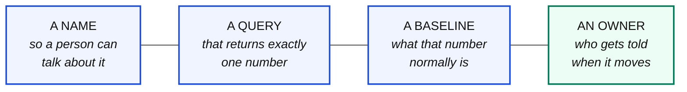
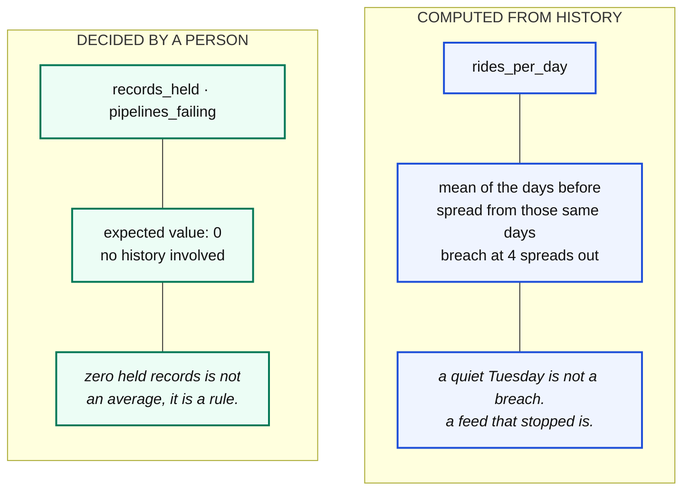

# The signal board

The thing that notices when a number stops making sense.

```bash
python cli.py board          # in the terminal
python cli.py dashboard      # in a browser, at http://localhost:8099
```

---

## A signal is four things



That is the whole idea. There is no model here and no intelligence.

> Deciding that 34% is far from 0.09% is **arithmetic**. Pretending otherwise is
> how people end up buying something they could have written in an afternoon.

### The field that actually matters is the owner

A breach with no name attached is a number on a screen that everybody assumes
somebody else is looking at.

```
-> surge_missing_pct is pricing's. Share of driver app records with no surge
   value. This is the one that moves when the mobile team renames a field
   without telling anybody.
```

That sentence is the output. Not a red light: a named person and a plain
description of what moved.

---

## The six signals

Between them they answer the four questions that go wrong: **did it arrive, is
it the right amount, is it the right shape, and does it still add up.**

| Signal | Owner | Watches | Catches |
|---|---|---|---|
| `pipelines_failing` | data-platform | `teach.runs` | work that did not happen |
| `records_held` | data-platform | `teach.quarantine` | a contract refusing things |
| `rides_per_day` | operations | `teach.gold_daily` | a feed that stopped, or a window built wrong |
| `events_per_ride` | streaming | `teach.bronze_events` | a replay that landed twice, or events being dropped |
| `rides_missing_fare` | finance | `teach.bronze_trips` | money that happened and cannot be reported |
| `surge_missing_pct` | pricing | `teach.bronze_driver_app` | a field that moved upstream |

### Read the one that is not about data at all

`pipelines_failing` looks at `teach.runs`. It does not look at a single row of
business data. It asks **whether the work happened**.

That matters because **a pipeline that never ran leaves perfectly valid data
behind**. Every row correct. Every row old. No check that looks only at values
will ever notice.

---

## Two kinds of baseline



### From history

```python
baseline = statistics.mean(history)
spread   = max(statistics.pstdev(history), 0.01)
z        = (value - baseline) / spread
breached = abs(z) > 4.0
```

The **z score** is how many spreads from normal the number sits.

### Why 4 and not 2

A z score of 2 fires on a quiet Tuesday. A z score of 4 fires when something
genuinely broke.

Set it too tight and the board cries wolf, people stop reading it, and you have
spent effort building something that made you **less** safe than having nothing.

### And one signal needs both

`events_per_ride` has a fixed baseline of `4.7` with a **tolerance** of `1.0`.

A completed ride emits five events and a cancelled one emits three, so the true
average sits a little under five. That is correct, not a fault.

Set that baseline to exactly `5` and the board breaches on day one, for a
perfectly healthy system. **That happened while building this course**, and the
fix was not a better algorithm, it was understanding the data.

---

## Where it runs, and where it must not

**Beside the warehouse, on a clock, after the pipelines have finished.**

Never inside a pipeline. A check that can block a write is a different thing
with a different name, and you already built that one: it is the contract.

In the Airflow DAG the board is the last task, and it **deliberately does not
fail the DAG** when a signal breaches:

```python
return "breached" if result.returncode == 1 else "clean"
```

*"A number moved and a human should look"* is not the same as *"the run is
broken"*. Failing there would page the on-call engineer for a number that is
often completely correct and just reflects a bad night of trading.

**Getting that distinction wrong is how teams end up ignoring their own
alerts.**

---

## Adding a signal

`signals/board.py`, and it is a dataclass:

```python
Signal(
    name="cancelled_rate",
    owner="operations",
    watches=f"{SCHEMA}.gold_daily",
    means="Share of rides cancelled on the latest day. A jump means the app "
          "shipped something, or a city has a problem.",
    unit="%",
    current_sql=f"""
        SELECT round(100.0 * cancelled / nullif(rides, 0), 2)
        FROM {SCHEMA}.gold_daily ORDER BY trip_date DESC LIMIT 1""",
    history_sql=f"""
        SELECT round(100.0 * cancelled / nullif(rides, 0), 2)
        FROM {SCHEMA}.gold_daily ORDER BY trip_date DESC OFFSET 1""",
)
```

Three rules for a new one:

**The query returns exactly one number.** If it returns a table, it is a report,
not a signal.

**`means` is written for the owner, not for you.** They will read it at 3am
having never seen the code.

**Give it an owner who exists.** "the data team" is not an owner.

---

## Watching it move

Notebook 9 is this, end to end:

```bash
python cli.py board        # take the reading first
python cli.py break        # move a field upstream, on purpose
python cli.py run all      # everything still says ok
python cli.py board        # surge_missing_pct has moved. Pricing's problem
python cli.py fix
python cli.py board        # back to where you started
```

Nothing fails at any point. Row counts do not change. That is the entire lesson.
